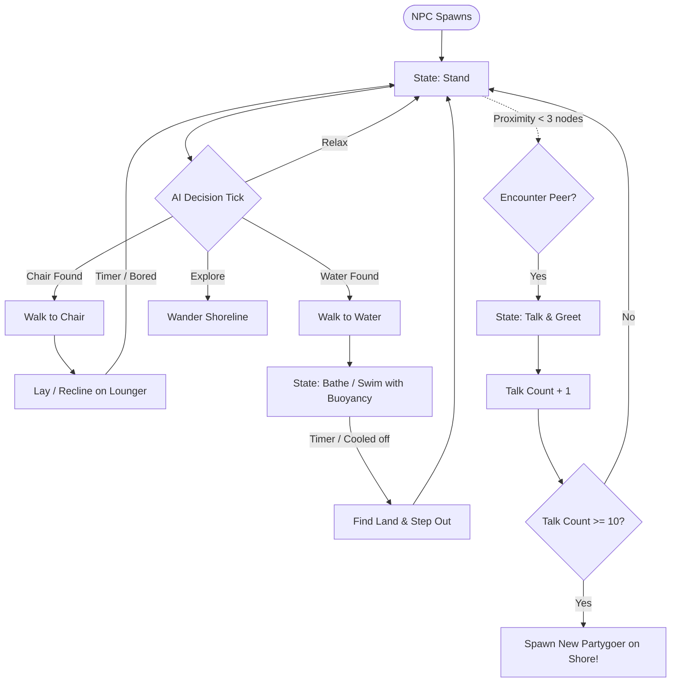

# 🏖️ Beach Party NPCs for Luanti / Minetest

[](https://www.luanti.org/)
[](https://www.lua.org/)
[](#)
[](#synergy-with-mini-beach-pack)
[](#performance--server-friendly-design)

> **Transform empty, quiet shores into buzzing, sun-drenched tropical destinations!**  
> *Beach Party NPCs* introduces intelligent, stylish, and fully autonomous partygoers who sunbathe, swim, socialize, and organically invite their friends to join the ultimate seaside celebration.

---

## 🌴 Why Beach Party NPCs?

Are your beaches deserted? You build gorgeous boardwalks, scenic coastlines, and beach resorts—only for them to feel like ghost towns.

**Beach Party NPCs** brings your coastal worlds alive with zero micro-management:
- 🍹 **Autonomous Beach Life**: NPCs actively seek out beach chairs to catch some rays, dive into the ocean for a swim, and stroll along the sands.
- 💬 **Organic Social Dynamics**: When beachgoers cross paths, they stop, chat, and gossip.
- 📈 **Viral Party Scaling**: Keep the vibes high! As NPCs talk and network, they invite new friends who walk right into your party.
- 🪑 **Plug-and-Play Compatibility**: Designed to integrate natively with [`mini_beach_pack`](#synergy-with-mini-beach-pack), utilizing custom beach chairs and umbrellas.
- ⚡ **Optimized for Servers**: Built-in 100-NPC population cap, auto-persistence across server restarts, and admin cleanup commands.

---

## ✨ Features at a Glance

```
       ☀️ SUNBATHING             🌊 SWIMMING               💬 SOCIALIZING             🎉 PARTY GROWTH
 ┌──────────────────────┐  ┌──────────────────────┐  ┌──────────────────────┐  ┌──────────────────────┐
 │ NPCs find loungers,  │  │ Intelligent water    │  │ Beachgoers stop,     │  │ Every 10 chats, NPCs │
 │ align automatically, │  │ physics with float-  │  │ turn to face each    │  │ invite a new friend  │
 │ & recline comfortably│  │ ing & shore returns  │  │ other, and chat      │  │ to join the party!   │
 └──────────────────────┘  └──────────────────────┘  └──────────────────────┘  └──────────────────────┘
```

### 🕶️ 1. 100 Unique Personalities & Diverse Beach Styles
- **100 Curated First Names**: From Liam and Olivia to Maverick and Jack, every beachgoer gets a distinct identity with a floating nametag.
- **6 Vibrant Beachwear Textures**: Tropical boardshorts, swimsuits, sunglasses, and summer colors provide authentic resort variety.
- **Persistent Data**: Names, skins, and social counts are preserved seamlessly across world reboots via engine mod storage.

### 🪑 2. Smart Sunbathing & Reclining AI
- NPCs actively search for nearby beach chairs (from `mini_beach_pack`) and beds.
- When an NPC claims an open lounger, they smoothly approach, pivot to face the ocean, and recline backward at a natural **23° angle** (`0.4 rad`) for the ultimate tanning session.

### 🌊 3. Ocean Bathing & Buoyancy Physics
- NPCs love taking a refreshing dip on a hot sunny day!
- Features custom **buoyant water physics** to ensure NPCs float gracefully, play in the surf, and never drown.
- Once they've cooled down, their AI scans for the shoreline and steps back onto dry sand to dry off.

### 💬 4. Dynamic Beach Chats & Social Circles
- When two partygoers bump into each other on the beach, they halt, turn face-to-face, and strike up a conversation.
- They remember who they've talked to, fostering realistic mingling rather than repetitive loops.

### 🎈 5. "Word-of-Mouth" Party Invitations
- The party grows naturally! Every time an NPC completes **10 social interactions**, they spread the word and invite another friend.
- A new guest spawns on the surrounding coast and walks straight toward the gathering.

### 🥚 6. Creative & Survival Ready
- Grab the custom **Beach Party NPC Spawn Egg** (`beach_party_npcs:npc_egg`) directly from your inventory.
- Place eggs anywhere to drop new partygoers straight onto the sand.

---

## 🪑 Synergy with Mini Beach Pack

*Beach Party NPCs* is engineered to pair perfectly with **`mini_beach_pack`**:

| Prop | Interaction with NPCs |
|---|---|
| **Beach Loungers (15 Colors)** | NPCs detect all 15 colored beach chairs, navigate to them, and recline naturally. |
| **Sun Umbrellas (15 Colors)** | Place sun umbrellas next to loungers to build a full resort cabana aesthetic. |
| **Standard Beds / Furniture** | Full fallback support for any item categorized under the `group:bed` node family. |

---

## 🎮 Items & Commands

### 🎒 Items

| Icon | Item ID | Name | Description |
|:---:|---|---|---|
| 🥚 | `beach_party_npcs:npc_egg` | **Beach Party NPC Spawn Egg** | Right-click any node to spawn a stylish beachgoer. Free in Creative; consumed in Survival. |

### 🛠️ Chat Commands

| Command | Privilege | Description |
|---|---|---|
| `/clear_npcs` | *Server / Singleplayer* | Instantly removes all active beach party NPCs, clears the population count, and resets the name cycle. |

---

## 📦 Installation & Setup

### Requirements

| Requirement | Notes |
|---|---|
| **Luanti / Minetest** | Version 5.0.0 or higher |
| **`default`** | Standard Minetest Game mod |
| **`mini_beach_pack`** | Required for beach chairs & loungers |

### Step-by-Step Installation

1. **Download / Clone** this repository into your Minetest/Luanti mods folder:
   ```bash
   cd ~/.minetest/mods/   # Linux
   # or %APPDATA%\minetest\mods\ (Windows)
   # or ~/Library/Application Support/minetest/mods/ (macOS)
   git clone https://github.com/your-username/beach_party_npcs.git
   ```
2. **Install `mini_beach_pack`** if you haven't already:
   - Ensure the `mini_beach_pack` folder is present inside your `mods/` directory.
3. **Enable the Mods**:
   - In Luanti / Minetest, select your world > click **Select Mods**.
   - Enable both **`mini_beach_pack`** and **`beach_party_npcs`**.
   - Click **Save**.
4. **Launch Your World** and head down to the shoreline!

---

## 🏖️ How to Host the Ultimate Beach Bash

Creating a thriving beach venue takes just a few minutes:

1. **Pick a Scenic Coastline**: Find a stretch of sand bordering open ocean or a tranquil lagoon.
2. **Set Up the Cabanas**: Place colourful beach chairs from `mini_beach_pack` along the water's edge, paired with matching sun umbrellas.
3. **Spawn the First Guests**: Use the **Beach Party NPC Spawn Egg** (`beach_party_npcs:npc_egg`) to spawn 3–5 initial party starters.
4. **Watch It Grow**:
   - Guests will walk between the waves and the sand.
   - Some will lay back on your chairs.
   - Others will jump into the ocean for a swim.
   - As they mingle and converse, more guests will arrive on their own!

---

## ⚡ Performance & Server-Friendly Design

*Beach Party NPCs* is crafted with server performance and multiplayer stability in mind:

- 🛡️ **Hard Population Cap**: Spawns are strictly capped at **100 NPCs** worldwide to protect tick rates and FPS.
- ⏱️ **Throttled AI Evaluation**: Strategic decisions run on staggered 1.0s interval ticks rather than heavy per-frame computations.
- 🌊 **Efficient Buoyancy**: Fluid detection checks water node groups directly, keeping collision calculations lightweight.
- 🧹 **Fail-Safe Cleanup**: Running `/clear_npcs` clears lingering entities and resets storage in one command.

---

## 🧠 Behind the Scenes: NPC Behavior Flowchart



---

## 🗺️ Roadmap & Upcoming Ideas

- [ ] 🏐 **Beach Volleyball Mini-Game**: Interactive balls and volleyball net nodes.
- [ ] 📻 **Boombox & Music**: Ambient tropical chiptunes and beach party beats.
- [ ] 🍹 **Tiki Bar & Refreshments**: NPCs ordering smoothies, mocktails, and snacks.
- [ ] 🔥 **Nighttime Bonfires**: Gathering around campfires with guitar and dance animations after dark.
- [ ] 🏄 **Surfing & Rafting**: Dynamic surfboards and floating pool inflatables.

---

## 🤝 Contributing

Contributions, issues, and feature suggestions are welcome!
Feel free to submit a pull request or open an issue on GitHub to help make the beach party even bigger.

---

## 📜 License

- **Code**: Open-source under the [MIT License](LICENSE) (or Lua Modding Community Standard).
- **3D Models & Textures**: Distributed with compatible open gaming licenses. See mod assets for attribution details.

---

<p align="center">
  <b>Bring the sunshine, grab a deckchair, and let the party begin! 🌴🍹🕶️</b>
</p>
